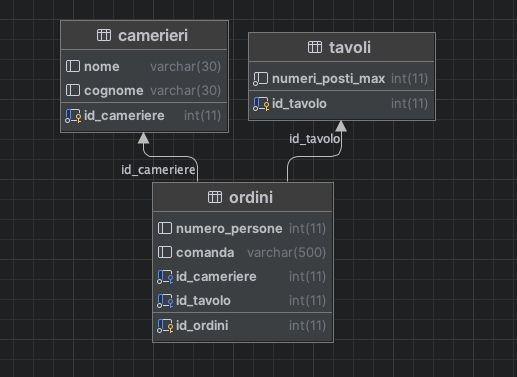

# Relazione Lauro Emanuele - Esercitazione pratica XAMPP 
### Testo esercitazione
Realizzare come indicato in laboratorio 201 l'esercizio fatto su classroom del Ristorante.

Allegare relazione finale di quanto fatto sul proprio pc.

### Svolgimento
Tramite lo schema da lei fornito, abbiamo creato il nostro database,
abbiamo creato 3 tabelle, con i rispettivi nomi, key e datatype:

| Ordini                    | Camerieri                 | Tavoli                 |
|---------------------------|---------------------------|------------------------|
| id_ordine (PK) int(11)    | id_cameriere (PK) int(11) | id_tavolo (PK) int(11) |
| id_tavolo (FK) int(11)    | nome varchar(30)          | num_posti_max int(11)  |
| id_cameriere (FK) int(11) | cognome varchar(30)       |                        |
| num_persone int(11)       |                           |                        |
| comanda varchar(500)      |
sotto in allegato l'immagine del diagramma

Le key id_cameriere (PK) e id_tavolo (PK), sono state collegate alle rispettive foreing keys,
ovvero id_cameriere e id_tavolo, sulla tabella degli ordini, in questo modo la tabella Ordini, dipende da
Tavoli e Camerieri.