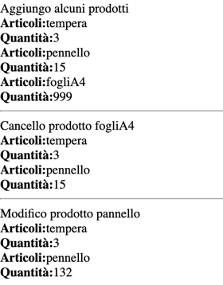

File carrello.php
```php
<?php

class Carrello
{
    var $articoli = array();
    var $quantita = array();

    function aggiungi_carrello($a, $q)
    {
        $position = count($this->articoli);
        $trovato = 0;
        for ($i = 0; $i < count($this->articoli); $i++) {
            if ($this->articoli[$i] == $a)
                $trovato = 1;
        }
        if ($trovato == 1) {
            $this->aggiorna($a, $q);
        } else {
            $this->articoli[$position] = $a;
            $this->quantita[$position] = $q;
        }
    }


    function aggiorna($n, $q)
    {
        $posizione = -1;
        for ($i = 0; $i < count($this->articoli); $i++) {
            if ($this->articoli[$i] == $n)
                $posizione = $i;
        }
        if ($posizione == -1) {
            echo "Prodotto non trovato <br>";
        } else {
            $this->quantita[$posizione] = $q;
        }
    }

    function togli_carrello($a)
    {
        $posizione = -1;
        for ($i = 0; $i < count($this->articoli); $i++) {
            if ($this->articoli[$i] == $a)
                $posizione = $i;
        }
        if ($posizione != -1) {
            $count = 0;

            for ($i = 0; $i < count($this->articoli); $i++) {
                if ($this->articoli[$i] != $a) {
                    $app_ar[$count] = $this->articoli[$i];
                    $app_qr[$count] = $this->quantita[$i];
                    $count++;
                }
            }
            unset($this->articoli);
            unset($this->quantita);

            for ($i = 0; $i < count($app_ar); $i++) {
                $this->articoli[$i] = $app_ar[$i];
                $this->quantita[$i] = $app_qr[$i];
            }
        } else {
            echo "prodotto non trovato! <br>";
        }
    }

    function stampa()
    {
        for ($i = 0; $i < count($this->articoli); $i++) {
            echo "<b>Articoli:</b>" . $this->articoli[$i] . "<br>";
            echo "<b>Quantità:</b>" . $this->quantita[$i] . "<br>";
        }
    }
}
```


carrellotest.php
```php
<?php
require_once("carrello.php");

$acquisti = new Carrello;

echo "<HR>Aggiungo alcuni prodotti <br>";
$acquisti->aggiungi_carrello("tempera", 5);
$acquisti->aggiungi_carrello("pennello", 15);
$acquisti->aggiungi_carrello("tempera", 3);
$acquisti->aggiungi_carrello("fogliA4", 999);
$acquisti->stampa();
echo "<HR>Cancello prodotto fogliA4<br>";
$acquisti->togli_carrello("fogliA4");
$acquisti->stampa();
echo "<HR>Modifico prodotto pannello<br>";
$acquisti->aggiorna("pennello", 132);
$acquisti->stampa();
```


La classe carrello consente di aggiungere, togliere e modificare gli oggetti all'interno del carrello
la rela visiva è




